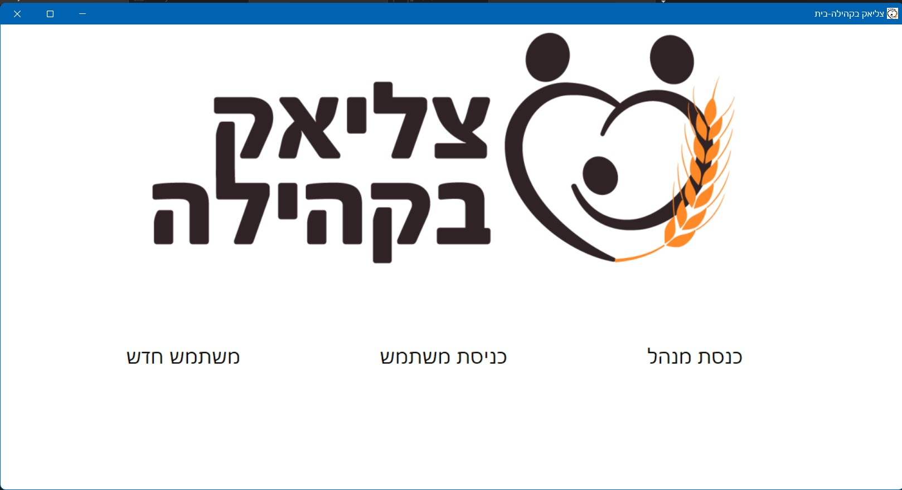
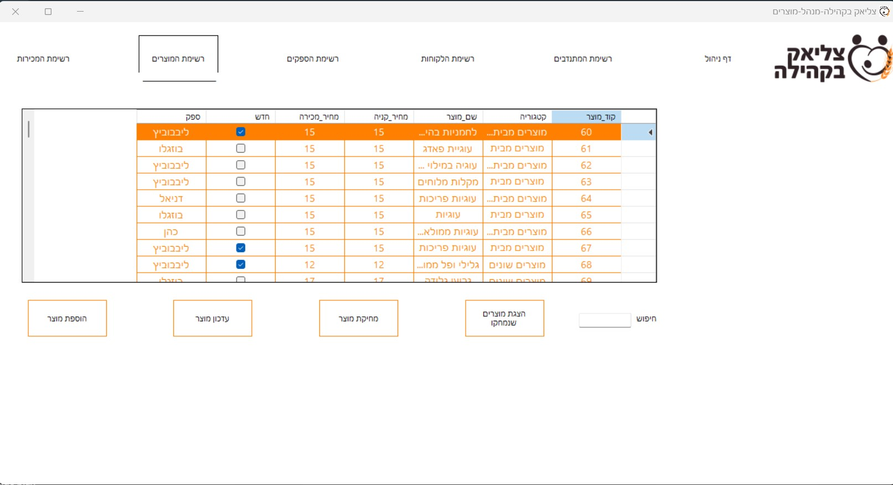

# "Celiac Bakehila" Management System

This is a desktop application built with C# WinForms for managing the activities of a non-profit organization supporting the celiac community. The system handles customer records, gluten-free products, volunteers, suppliers, and sales. The application supports multiple user roles, each with a customized dashboard and capabilities.

---

## 🌟 Features

- 🔐 Role-based login: Admin, Branch Manager, Customer  
- 🛒 Product management and sales of gluten-free items  
- 📍 Multi-branch structure with per-branch control  
- 📦 Order management (create orders, view history, checkout)  
- 🧑‍🤝‍🧑 Customer registration, profile updates, and purchase history  
- 🧾 Printable order details for branch managers  
- 🧮 Real-time sales and order tracking  
- 🧠 Simple and intuitive user interface for all roles  

---

## 👥 User Roles

### 🛠 Admin Dashboard
- Manage branches, suppliers, and products
- Create and manage new sales
- Assign products to each sale

### 🧍 Customer Dashboard
- Register/login via phone number
- Update personal information
- View information about the organization
- Place orders during active sales (add to cart, checkout, view past orders)

### 🏢 Branch Manager Dashboard
- View customers linked to their branch
- View and print order details

---

## 🖥 Technologies Used

- C# WinForms (.NET Framework)  
- Local database (Microsoft Access)  
- Visual Studio  
- Layered architecture (DATA, BLL, GUI)  

---

## 🖼️ Screenshots

### 🔐 Login Screen


### 🧑‍💼 Part Of Admin Dashboard


### 👨🏼‍💼 Part Of Station Manager Dashboard


### 🛒 Customer Order Page


## 🚀 Getting Started

### Prerequisites:
- Windows OS  
- Visual Studio 2019 or newer  
- .NET Framework installed (version as used in project)  
- Local database (Microsoft Access)  

### Run the Application:

1. Clone the repository:
   ```bash
   git clone https://github.com/yourusername/celiac-management.git
   ```

2. Open the solution (`.sln`) file in Visual Studio.

3. Build the project using:
   ```
   Build > Build Solution (Ctrl+Shift+B)
   ```

4. Configure your database connection if needed.

5. Run the application:
   ```
   Debug > Start Debugging (F5)
   ```

---

## 📂 Project Structure

```
/celiacBakehila
│
├── BLL/                    # Business Logic Layer
├── DATA/                   # Data Access Layer (including Access DB logic)
├── GUI/                    # Windows Forms UI (forms and components)
├── Properties/             # Project settings
├── Resources/              # Resource files (e.g., icons, images)
├── picture/                # Image files used in GUI
├── pictures/               # Possibly additional or legacy images
│
├── App.config              # Application configuration file
├── ClassDiagram1.cd        # Class diagram for system structure
├── Form1.cs                # Main form logic
├── Form1.Designer.cs       # Main form UI design code
├── Form1.resx              # Resource file for form
├── Program.cs              # Entry point for the application
├── celiacBakehila.csproj   # C# project file
├── celiacBakehila.sln      # Visual Studio solution file
├── README.md               # Project documentation
└── .gitignore              # Git ignore configuration
```

---

## 🔒 Login Simulation

- Admin: `123`
- Customer: registering for the system, and logging in with the phone number with which registration was made
- Branch Manager: login to the customer interface with the station manager's phone number (according to data in the DB)

> (These credentials are only for development and testing purposes)

---


## 📃 License

This project is for educational, non-commercial use.
